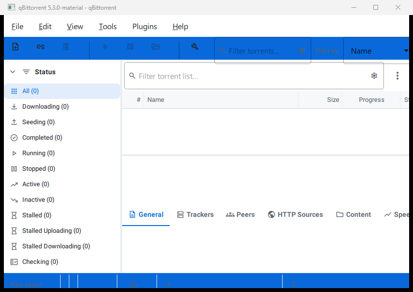

# Building qBittorrent Material

The project uses CMake and Ninja. The supported Windows helper builds with
MSVC 2022 and downloads Qt 6.8.3 plus the remaining dependencies into the
repository on first use.

## Windows: build and run

Install Visual Studio 2022 Build Tools with the C++ workload first. If it is
not already installed, run:

```powershell
winget install --id Microsoft.VisualStudio.2022.BuildTools -e --override "--quiet --add Microsoft.VisualStudio.Workload.VCTools --includeRecommended"
```

Then run the helper from the repository root:

```powershell
# Build and launch the application
powershell -ExecutionPolicy Bypass -File .\run.ps1

# Build without launching
powershell -ExecutionPolicy Bypass -File .\run.ps1 -NoRun

# Remove the previous build first
powershell -ExecutionPolicy Bypass -File .\run.ps1 -Clean -NoRun

# Override the default parallel job count
powershell -ExecutionPolicy Bypass -File .\run.ps1 -NoRun -Jobs 8
```

The first build can take a while because the helper installs CMake, Ninja,
Python, and NSIS when necessary, downloads Qt 6.8.3 to `.qt`, and builds the
vcpkg dependencies in `.vcpkg`. Visual Studio Build Tools must be installed by
the user.

## Windows: build an installer

Use the same helper with `-Package` to build the application and create a
self-contained NSIS installer:

```powershell
powershell -ExecutionPolicy Bypass -File .\run.ps1 -Package
```

Packaging mode reports the generated installer path and exits without launching
the application. It can be combined with `-Clean` or `-Jobs <count>`.

CPack writes the installer and its SHA-256 checksum to:

```text
build\packages\
```

Installer names follow this pattern:

```text
qBittorrent-Material-<version>-<build-id>-windows-x64.exe
```

The package includes the Qt runtime, plugins, and QML imports required to run
the installed application.

## Visual smoke-test gallery

The checked-in visual gallery was captured from the installed Windows package
using a fresh test profile. It provides a quick UI handoff alongside the
installer build and smoke test:



See the complete [visual tour](SCREENSHOTS.md) for the toolbar, filters,
transfer workspace, properties tabs, and status bar.

If the build is already configured, the equivalent packaging command is:

```powershell
cpack --config build\CPackConfig.cmake -G NSIS -C Release
```

## Manual CMake build

For an existing Qt and libtorrent installation, configure and build directly:

```powershell
cmake -S . -B build -G Ninja `
  -DCMAKE_BUILD_TYPE=Release `
  -DCMAKE_TOOLCHAIN_FILE="<vcpkg>\scripts\buildsystems\vcpkg.cmake" `
  -DVCPKG_TARGET_TRIPLET=x64-windows-static-md `
  -DCMAKE_PREFIX_PATH="<Qt>\6.8.3\msvc2022_64"
cmake --build build --parallel
```

CMake requires Qt 6.6 or newer, libtorrent-rasterbar 2.0.7 or newer, Boost
1.76 or newer, OpenSSL 3.0 or newer, and Zlib 1.2.11 or newer.

## Linux and macOS

The Unix helper installs dependencies using a supported system package manager,
then configures and builds with CMake and Ninja:

```sh
./run.sh          # build and run
./run.sh --no-run # build only
./run.sh --clean  # clean, build, and run
```

## Continuous Windows prereleases

Every branch push triggers the `Build and release every push` GitHub Actions
workflow. It builds on `windows-2022` with MSVC 2022 and Qt 6.8.3, creates and
smoke-tests the NSIS installer, and publishes it as a GitHub prerelease:

- A GitHub prerelease containing the Windows x64 installer as its release asset.

The workflow intentionally does not retain a separate Actions artifact.

Each push receives a unique tag in the form
`build-<run-number>-<short-sha>`. The prerelease targets the exact pushed
commit and records the branch, build ID, and installer SHA-256 checksum in its
release notes. The workflow can also be started manually with
`workflow_dispatch`.
